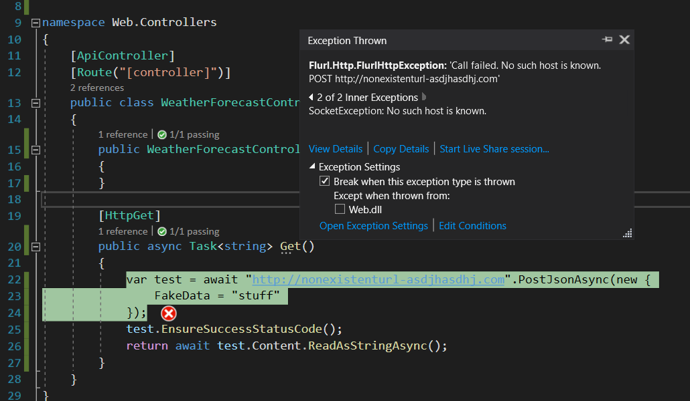

# Flurl threading bug

This repo contains the minimal code required to replicate a possible bug in the
Flurl library.

The problem is that, in .NET core 3.1 projects, integration tests using the Flurl `HttpTest`
class fail.
The same integration tests pass in earlier versions of .NET.

```csharp
/// <summary>
/// This integration test fails but should pass
/// </summary>
/// <returns></returns>
[Fact]
public async Task IntegrationTest()
{
    using (var httpTest = new HttpTest())
    {
        // Arrange
        const string expected = "expected-response";
        httpTest.RespondWith(expected);
        var client = _factory.CreateClient();

        // Act
        var response = await client.GetAsync("/weatherforecast");
        response.EnsureSuccessStatusCode();
        var result = await response.Content.ReadAsStringAsync();

        // Assert
        Assert.Equal(expected, result);
    }
}
```

The following error is thrown during execution of the test.



## Expected result

No actual call to "http://nonexistenturl-asdjhasdhj.com" should be attempted, instead the
mocked response configuring during the test setup should be returned.

## Actual result

During execution of the integration test, an actual call to "http://nonexistenturl-asdjhasdhj.com"
is attempted and fails, causing the test to fail.

## Additional information

In the Flurl library [HttpTest.cs](https://github.com/tmenier/Flurl/blob/dev/src/Flurl.Http/Testing/HttpTest.cs#L109) the behavior of the `GetCurrentTest` method is changed for different .NET versions using preprocessor directives.

In .NET core 3.1 the code inside the `else` preprocessor directive is executed and because this uses Thread local state
the `HttpTest` setup is lost when integration tests are run as they run on a separate thread.

```csharp
#if NET45
		private static void SetCurrentTest(HttpTest test) => System.Runtime.Remoting.Messaging.CallContext.LogicalSetData("FlurlHttpTest", test);
		private static HttpTest GetCurrentTest() => System.Runtime.Remoting.Messaging.CallContext.LogicalGetData("FlurlHttpTest") as HttpTest;
#elif NETSTANDARD1_1
		private static HttpTest _test;
		private static void SetCurrentTest(HttpTest test) => _test = test;
		private static HttpTest GetCurrentTest() => _test;
#else
		private static readonly System.Threading.AsyncLocal<HttpTest> _test = new System.Threading.AsyncLocal<HttpTest>();
		private static void SetCurrentTest(HttpTest test) => _test.Value = test;
		private static HttpTest GetCurrentTest() => _test.Value;
#endif
```
